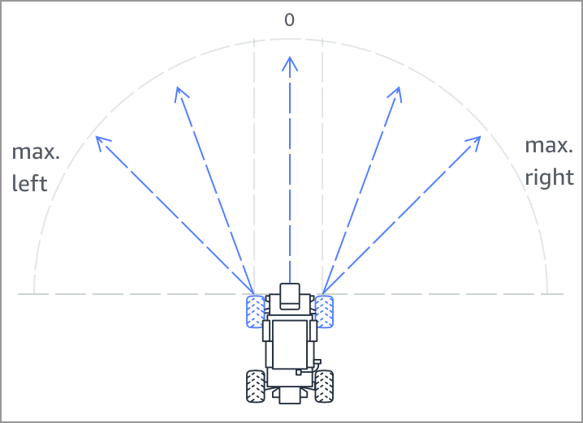

#

## Action Space

| Action No. #| Steering Angle (°) | Speed (m/s)|
| :---------- | :-----------:      | ----------:|
| 0           | 0.0                | 4.00       |
| 1           | 0.0                | 3.00       |
| 2           | 0.0                | 2.00       |
| 3           | 0.0                | 1.00       |
| 4           | 15.0               | 2.50       |
| 5           | -15.0              | 2.50       |
| 6           | 15.0               | 1.00       |
| 7           | -15.0              | 1.00       |
| 8           | 30.0               | 1.00       |
| 9           | -30.0              | 1.00       |

## Hyperparameter Values

| Hyperparameter                                                       | Value  |
| :----------                                                          | ------:|
| Gradient descent batch size                                          | 64     |
| Entropy                                                              | 0.01   |
| Discount factor                                                      | 0.985  |
| Loss type                                                            | Huber  |
| Learning rate                                                        | 0.0004 |
| Number of experience episodes between each policy-updating iteration | 30     |
| Number of epochs                                                     | 3      |

## Evaluation Results

Trial    Time      Trial results   Status     Off-track Off-track penalty   Crashes  Crash penalty
1    00:10.727    100%            Lap complete    0        --                  0          --
2    00:11.473    100%            Lap complete    0        --                  0          --
3    00:11.933    100%            Lap complete    0        --                  0          --
